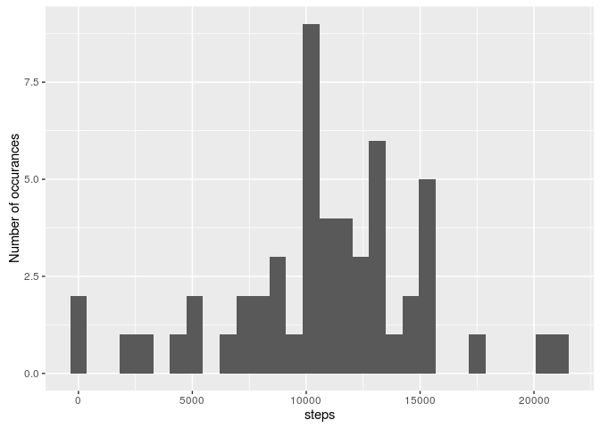
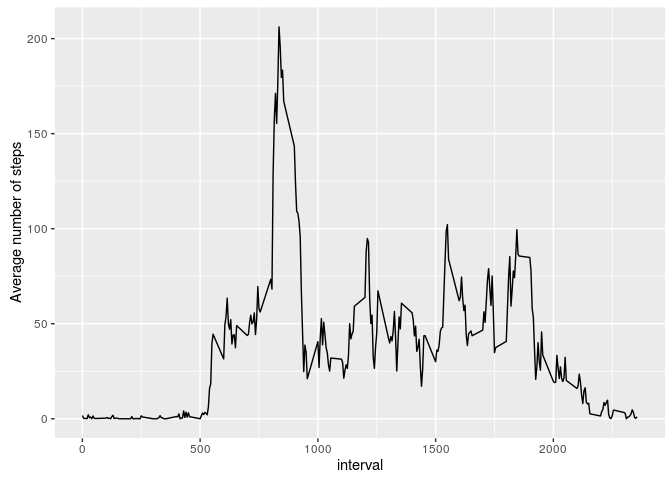
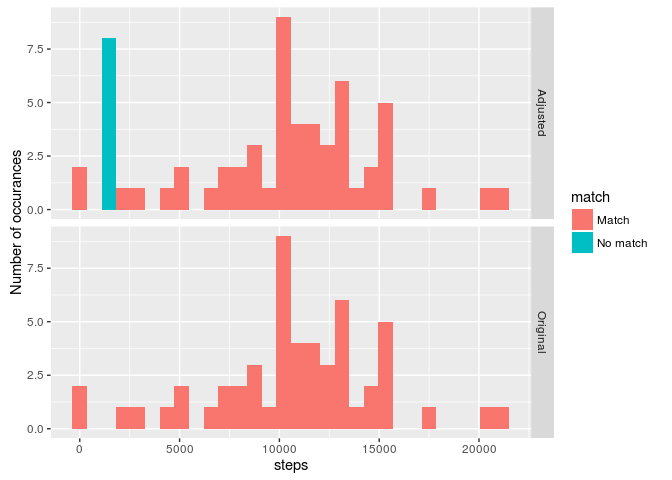
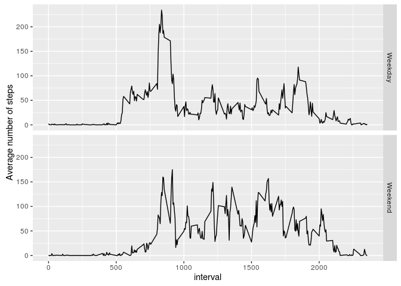

# Reproducible Research: Peer Assessment 1
## Introduction
This document will describe my solutions for this weeks assignment for Reproducible Research.  
It depends on the following libraries  
  
* dplyr  
* ggplot2  

I come from a SQL background myself so I find the dplyr way of thinking quite comfortable. Most of the data manipulation is done with this package. 

## Loading and preprocessing the data
First off, we'll load the necessary libraries and read the activity.csv file. 


```r
#load the libraries
library(dplyr)
library(ggplot2)

#unzip the zip file
unzip("activity.zip")
# Read the CSV
activity  <- read.csv("activity.csv")
```

The original contents will be stored in the activity variable. This will form the basis for all further changes/mutations.  
  
For multiple questions a dataset will be required with the NA values removed. We'll create one now for easy referencing. 


```r
#remove the NA values 
activity_cleaned <- activity[!is.na(activity$steps), ]
```

## What is mean total number of steps taken per day?
This part consists of two subsections: 

1. Make a histogram of the total number of steps taken each day  
2. Calculate and report the mean and median total number of steps taken per day

For both of them we first need to aggregate our data to a full day, for this we will use the "cleaned" dataset 


```r
#summarise by day
activity_day <- 
    group_by(activity_cleaned, date) %>%
    summarise(steps = sum(steps))
```

### Histogram of total number of steps each day
The histogram will be created with GGPlot2. A simple geom_history function will suffice. 

```r
#Show histogram of total steps per day. 
g  <- ggplot(data = activity_day, aes(x=steps)) + geom_histogram(bins=30) + ylab("Number of occurances")
print(g)
```

<!-- -->

And here we have our histogram. 

### Mean and everage of total steps on a day

Next we calculate the average and median of the steps and we're all done for this part. 


```r
print(paste("The average number of steps is: ",  mean(activity_day$steps)))
```

```
## [1] "The average number of steps is:  10766.1886792453"
```

```r
print(paste("The median number of steps is: ",  median(activity_day$steps)))
```

```
## [1] "The median number of steps is:  10765"
```

## What is the average daily activity pattern?
For these questions we make a new dataset called activity_interval. This contains a average of steps aggregated by interval. 

```r
#Average by interval For future use we also add the median
activity_interval <- group_by(activity_cleaned, interval) %>%
    summarise(averageSteps = mean(steps), medianSteps = median(steps))
```

We're cheating a little bit here by also adding the median for future use :) 

### Time series plot of the interval
Next we make a time series plot where we show the average number of steps taken across all days. 

```r
g <- ggplot(data = activity_interval, aes(x=interval, y=averageSteps)) + geom_line() + ylab("Average number of steps")
print(g)
```

<!-- -->

### Which interval contains the most steps? 
To answer this question we first find the index with the most steps on average and use this index to show the highest value


```r
maxstep_index <- which.max(activity_interval$averageSteps)
print(paste("Interval with most steps: ", activity_interval$interval[maxstep_index])) 
```

```
## [1] "Interval with most steps:  835"
```


## Imputing missing values

Next up: making up for lost values. 

### Report the total number of missing values in the dataset

This question is rather straightforward, we use complete.cases to make sure ALL columns are filled. 

```r
#Total numer of rows with missing values. 
#using complete.cases to make sure ALL columns are filled and not just steps. 
print(paste("Total number of missing rows: " , nrow(activity[!complete.cases(activity),])))
```

```
## [1] "Total number of missing rows:  2304"
```

### Devise a strategy to replace the missing values
So what's a good strategy to replace these missing values?  
We could choose to take an average of the day, but there are quire a few missing values within a single day. Therefor we take similar intervals instead. We will use the median instead of the mean because there are quite a few days on which our subject doesn't move at all for certain intervals, a mean would give a much higher interval than would most likely be the case.

### Create a new dataset with missing data filled in
We're now going to make a dataset with the new data.

```r
#There are days where there are no steps available at all. Most of the nas are large stretches of time. 
#It would be safest to take the median of other intervals to fill in the gaps. 
#hook up the interval data from before
activity_filled <- left_join(activity, activity_interval, by="interval") %>%
    mutate(steps = ifelse(is.na(steps), medianSteps, steps)) %>%
    select(steps, date, interval)
```
Remember that extra value we added for activity_interval? Well we get to use it now.  
  
Because the next question requires a comparison, we're going to add the dataset from the original histogram as well. A column called "set" is added with the value "Adjusted" for the new set and "Original" for the old.  


```r
#Next we make a new set aggregated by day similar to the first assignment 
#We include the original set for comparison

activity_filled_day <- 
    group_by(activity_filled, date) %>%
    summarise(steps = sum(steps)) %>%
    mutate(set = "Adjusted") %>%
    rbind(mutate(activity_day, set = "Original"))
```

Now we have both datasets in one variable, ready for comparison. 

### Make a comparison with the original values

Because I apparently have way too much time on my hands, we're going to compare for each observation if it matches with the other dataset and add the result in a column called " match"


```r
#Create a match filter to show the differences between both sets
match  <- filter(activity_filled_day, set == "Adjusted")  %>%
    left_join( filter(activity_filled_day, set == "Original"), by="date") %>%
    mutate(match = ifelse(steps.x != steps.y | is.na(steps.y), "No match", "Match")) %>%
    select(date, match)

activity_filled_day <- left_join(activity_filled_day, match, by="date")
```

First we'll make the histogram to show the differences. With the match comparison we'll color in the difference so we can see what's changed compared to the original. 


```r
g  <- ggplot(data = activity_filled_day, aes(x=steps)) + geom_histogram(bins=30, aes(fill = match)) + facet_grid(set~.) + ylab("Number of occurances")
print(g)
```

<!-- -->

As you can see, a whole new bar has popped up, the rest has stayed the same. So how will this affect the mean and the median? 

We'll start with the mean: 

```r
print(paste("The original mean value is: " , mean(filter(activity_filled_day, set=="Original")$steps)))
```

```
## [1] "The original mean value is:  10766.1886792453"
```

```r
print(paste("The adjusted mean value is: " , mean(filter(activity_filled_day, set=="Adjusted")$steps)))
```

```
## [1] "The adjusted mean value is:  9503.86885245902"
```

Well looks like the mean has dropped a bit, this is in line with what we saw in the histogram.  
  
So how does the median look?


```r
print(paste("The original median value is: " , median(filter(activity_filled_day, set=="Original")$steps)))
```

```
## [1] "The original median value is:  10765"
```

```r
print(paste("The adjusted median value is: " , median(filter(activity_filled_day, set=="Adjusted")$steps)))
```

```
## [1] "The adjusted median value is:  10395"
```

Looks like the median dropped as well. Again, not a surprise since the histogram has showed us as much. 

## Are there differences in activity patterns between weekdays and weekends?

### Create a new factor variable
Ok, so for our last assignment we have to divide the days into weekdays and weekends.  
First of all we'll make sure that we're all working with the English locale so we all know what to expect from the weekdays() output. 

```r
Sys.setlocale("LC_TIME", "C")
```

```
## [1] "C"
```

Next we'll add a new column called weekpart which will be filled depending on the weekdays value of the date field. If it's Saturday or Sunday, it'll be a weekend, otherwise we'll assume it's a weekday. Next it'll be grouped and averaged to give us the values we need.


```r
activity_week <- mutate(activity_cleaned
                           , weekpart = ifelse(weekdays(as.Date(date)) %in% c("Saturday", "Sunday"), "Weekend", "Weekday")
                           )%>%
    group_by(weekpart, interval) %>%
    summarise(steps = mean(steps, na.rm = TRUE))
```

And finally we get to draw our chart to show the differences. 


```r
g <- ggplot(activity_week, aes(x=interval, y=steps)) + geom_line() + facet_grid(weekpart~.)  + ylab("Average number of steps")
print(g)
```

<!-- -->

Looks like our subject in the weekends:  

* Gets active later in the day
* Is more active throughout the day
* Still has some activity after 20.00 


